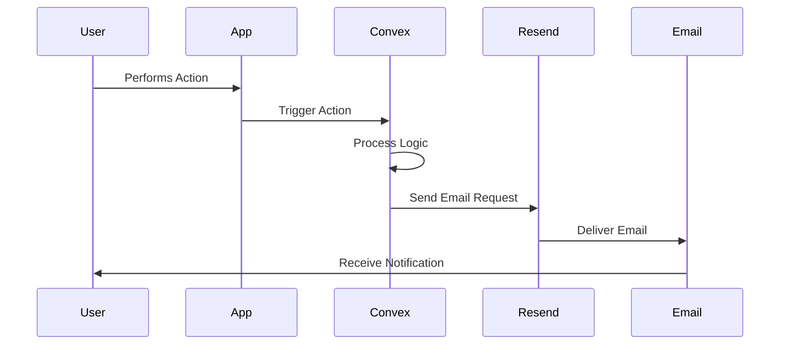

import { Callout } from 'fumadocs-ui/components/callout';

<Callout title="Demo Only" type="info">
  This is a dummy documentation page for demo purposes—there's no real product idea here. Content is placeholder and not based on an actual project.
</Callout>

Document the user journeys and interaction flows for your application.

<Warning>
Customize these user flows based on your specific product requirements!
</Warning>

## Primary User Flows

### Onboarding Flow

<Mermaid
  chart="
graph TB
    Start([User Visits Site])
    Landing[Landing Page]
    SignUp[Sign Up with Clerk]
    Profile[Complete Profile]
    Welcome[Welcome Dashboard]
    Explore[Explore Features]
    
    Start --> Landing
    Landing --> SignUp
    SignUp --> Profile
    Profile --> Welcome
    Welcome --> Explore
    
    style Start fill:#64748b,stroke:#334155,color:#fff
    style Landing fill:#f59e0b,stroke:#d97706,color:#fff
    style SignUp fill:#10b981,stroke:#059669,color:#fff
    style Profile fill:#8b5cf6,stroke:#7c3aed,color:#fff
    style Welcome fill:#ec4899,stroke:#db2777,color:#fff
    style Explore fill:#14b8a6,stroke:#0d9488,color:#fff
"
/>

**Steps:**
1. User lands on homepage
2. Clicks "Get Started" or "Sign Up"
3. Clerk authentication modal opens
4. User creates account (email/OAuth)
5. Redirected to profile setup (optional)
6. Arrives at dashboard with onboarding tips

### Subscription Purchase Flow

<Mermaid
  chart="
graph TB
    Browse[Browse Pricing]
    Select[Select Plan]
    Auth{Authenticated?}
    Login[Sign In]
    Checkout[Polar Checkout]
    Payment[Complete Payment]
    Confirm[Confirmation Page]
    Access[Access Premium Features]
    
    Browse --> Select
    Select --> Auth
    Auth -->|No| Login
    Auth -->|Yes| Checkout
    Login --> Checkout
    Checkout --> Payment
    Payment --> Confirm
    Confirm --> Access
    
    style Browse fill:#f59e0b,stroke:#d97706,color:#fff
    style Select fill:#eab308,stroke:#ca8a04,color:#fff
    style Auth fill:#64748b,stroke:#334155,color:#fff
    style Login fill:#10b981,stroke:#059669,color:#fff
    style Checkout fill:#8b5cf6,stroke:#7c3aed,color:#fff
    style Payment fill:#ec4899,stroke:#db2777,color:#fff
    style Confirm fill:#14b8a6,stroke:#0d9488,color:#fff
    style Access fill:#10b981,stroke:#059669,color:#fff
"
/>

**Steps:**
1. User views pricing page
2. Selects subscription tier
3. System checks authentication
4. If not logged in: redirected to sign in
5. Polar.sh checkout modal opens
6. User completes payment
7. Webhook updates subscription status
8. Confirmation page with next steps
9. Premium features unlocked

### Core Feature Usage Flow

Document your main feature's user flow:

<Mermaid
  chart="
graph TB
    Dashboard[Dashboard]
    NewItem[Create New Item]
    Form[Fill Form]
    Validate{Valid?}
    Save[Save to Database]
    Success[Success Message]
    ViewList[View Items List]
    Edit[Edit Item]
    Delete[Delete Item]
    
    Dashboard --> NewItem
    Dashboard --> ViewList
    NewItem --> Form
    Form --> Validate
    Validate -->|No| Form
    Validate -->|Yes| Save
    Save --> Success
    Success --> ViewList
    ViewList --> Edit
    ViewList --> Delete
    Edit --> Form
    
    style Dashboard fill:#64748b,stroke:#334155,color:#fff
    style NewItem fill:#10b981,stroke:#059669,color:#fff
    style Form fill:#f59e0b,stroke:#d97706,color:#fff
    style Validate fill:#eab308,stroke:#ca8a04,color:#fff
    style Save fill:#8b5cf6,stroke:#7c3aed,color:#fff
    style Success fill:#14b8a6,stroke:#0d9488,color:#fff
    style ViewList fill:#ec4899,stroke:#db2777,color:#fff
    style Edit fill:#f59e0b,stroke:#d97706,color:#fff
    style Delete fill:#ef4444,stroke:#dc2626,color:#fff
"
/>

## Secondary User Flows

### Email Notification Flow

**Triggers:**
- Welcome email on signup
- Subscription confirmation
- Payment receipt
- Feature notifications
- Weekly digest

### AI Chat Interaction Flow

<Mermaid
  chart="
graph LR
    User[User Types Message]
    Send[Send to Backend]
    OpenAI[OpenAI API]
    Stream[Stream Response]
    Display[Display to User]
    
    User --> Send
    Send --> OpenAI
    OpenAI --> Stream
    Stream --> Display
    Display --> User
    
    style User fill:#64748b,stroke:#334155,color:#fff
    style Send fill:#f59e0b,stroke:#d97706,color:#fff
    style OpenAI fill:#10b981,stroke:#059669,color:#fff
    style Stream fill:#8b5cf6,stroke:#7c3aed,color:#fff
    style Display fill:#14b8a6,stroke:#0d9488,color:#fff
"
/>

**Steps:**
1. User types message in chat
2. Message sent to Convex action
3. Action calls OpenAI API
4. Response streamed back to client
5. UI updates in real-time

## Error & Edge Cases

### Payment Failure Flow

<Mermaid
  chart="
graph TB
    Payment[Payment Attempt]
    Success{Success?}
    Complete[Payment Complete]
    Failed[Payment Failed]
    Retry{Retry?}
    Support[Contact Support]
    UpdateMethod[Update Payment Method]
    
    Payment --> Success
    Success -->|Yes| Complete
    Success -->|No| Failed
    Failed --> Retry
    Retry -->|Yes| UpdateMethod
    Retry -->|No| Support
    UpdateMethod --> Payment
    
    style Payment fill:#64748b,stroke:#334155,color:#fff
    style Success fill:#eab308,stroke:#ca8a04,color:#fff
    style Complete fill:#10b981,stroke:#059669,color:#fff
    style Failed fill:#ef4444,stroke:#dc2626,color:#fff
    style Retry fill:#f59e0b,stroke:#d97706,color:#fff
    style Support fill:#8b5cf6,stroke:#7c3aed,color:#fff
    style UpdateMethod fill:#14b8a6,stroke:#0d9488,color:#fff
"
/>

### Session Expiration Flow

<Mermaid
  chart="
graph TB
    Active[User Active]
    Expire[Session Expires]
    Detect[Detect Expiration]
    Modal[Show Re-auth Modal]
    ReAuth[Re-authenticate]
    Restore[Restore Session]
    Continue[Continue Work]
    
    Active --> Expire
    Expire --> Detect
    Detect --> Modal
    Modal --> ReAuth
    ReAuth --> Restore
    Restore --> Continue
    Continue --> Active
    
    style Active fill:#10b981,stroke:#059669,color:#fff
    style Expire fill:#ef4444,stroke:#dc2626,color:#fff
    style Detect fill:#f59e0b,stroke:#d97706,color:#fff
    style Modal fill:#eab308,stroke:#ca8a04,color:#fff
    style ReAuth fill:#8b5cf6,stroke:#7c3aed,color:#fff
    style Restore fill:#14b8a6,stroke:#0d9488,color:#fff
    style Continue fill:#10b981,stroke:#059669,color:#fff
"
/>

## Mobile vs Desktop Flows

### Responsive Behavior

| Action | Mobile Flow | Desktop Flow |
|--------|-------------|--------------|
| Navigation | Bottom tab bar | Sidebar menu |
| Create Item | Full-screen modal | Right-side panel |
| Sign In | Native modal | Clerk modal overlay |
| Search | Dedicated search page | Instant search dropdown |
| Settings | Separate page | Slide-out panel |

## Conversion Funnel

Track where users drop off:

<Mermaid
  chart="
graph TB
    Visit[Site Visitors: 100%]
    Signup[Sign Ups: 20%]
    Trial[Start Trial: 15%]
    Active[Active Users: 10%]
    Paid[Paid Subscribers: 5%]
    
    Visit --> Signup
    Signup --> Trial
    Trial --> Active
    Active --> Paid
    
    style Visit fill:#64748b,stroke:#334155,color:#fff
    style Signup fill:#f59e0b,stroke:#d97706,color:#fff
    style Trial fill:#eab308,stroke:#ca8a04,color:#fff
    style Active fill:#14b8a6,stroke:#0d9488,color:#fff
    style Paid fill:#10b981,stroke:#059669,color:#fff
"
/>

**Drop-off Points to Monitor:**
1. **Landing → Sign Up**: Unclear value proposition?
2. **Sign Up → Trial**: Friction in onboarding?
3. **Trial → Active**: Feature complexity?
4. **Active → Paid**: Pricing concerns?

## User Personas & Flows

### Persona 1: First-Time User

**Goal**: Understand the product and complete first task

**Flow:**
1. Lands on homepage
2. Watches demo video
3. Signs up for free account
4. Completes onboarding tutorial
5. Creates first item
6. Invites team member (optional)

### Persona 2: Returning User

**Goal**: Quick access to regular workflow

**Flow:**
1. Direct login from bookmark
2. Dashboard shows recent activity
3. Continues previous work
4. Performs daily tasks
5. Logs out

### Persona 3: Power User

**Goal**: Maximize efficiency with advanced features

**Flow:**
1. Uses keyboard shortcuts
2. Bulk operations
3. API integration setup
4. Custom automation rules
5. Analytics dashboard review

## Accessibility Considerations

- **Keyboard Navigation**: All flows accessible via keyboard
- **Screen Readers**: ARIA labels for flow steps
- **Visual Indicators**: Clear focus states
- **Error Messages**: Descriptive and actionable
- **Skip Links**: Jump to main content

## Flow Optimization Opportunities

<Note>
Continuously monitor and optimize these user flows based on analytics and user feedback.
</Note>

### Metrics to Track

- **Time to First Value**: How quickly users achieve their first success
- **Completion Rate**: % of users who finish key flows
- **Drop-off Points**: Where users abandon the flow
- **Error Rate**: How often users encounter errors
- **User Satisfaction**: Feedback scores for each flow